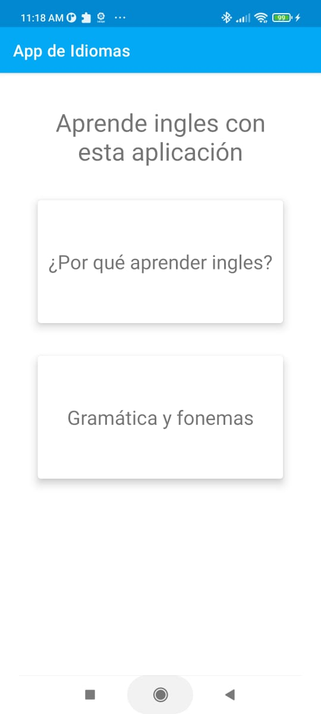
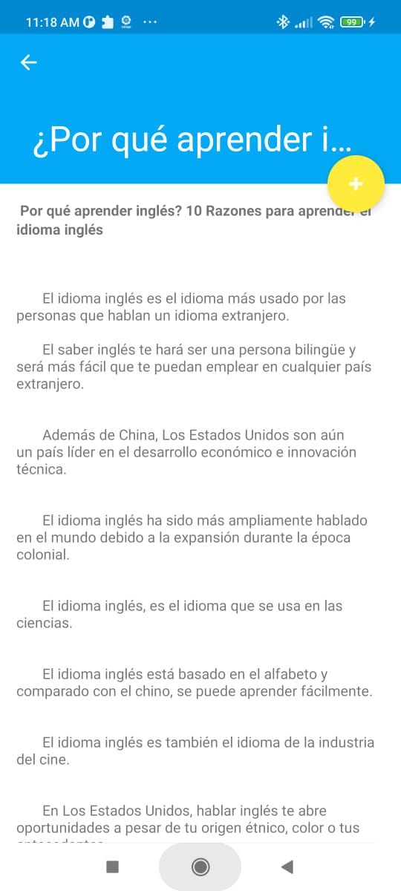
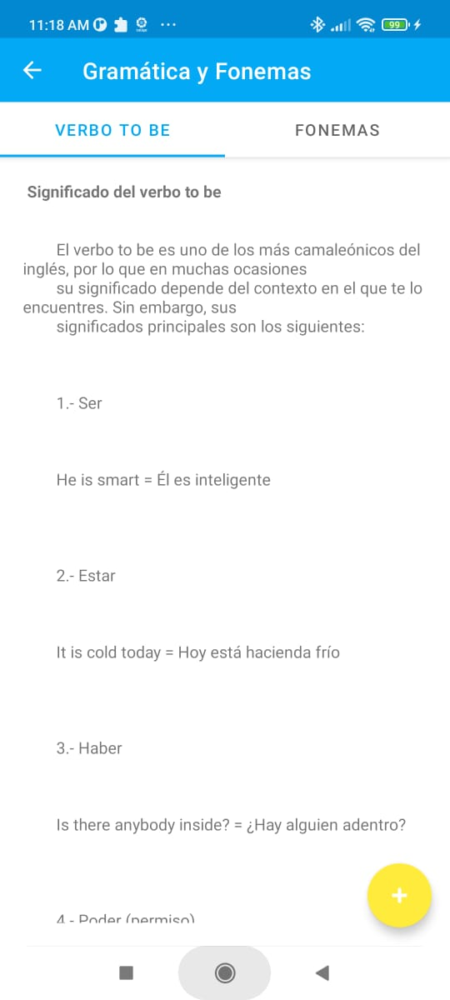

# Practica 1 Layouts y más layouts

Daniel Alejandro Calderon Virgen  
No Crtl 18401090  
Ing en Sistemas Computacionales  
Tecnológico Nacional de México, Campus Tepic    

LABORATORIO DE APLICACIONES PARA DISPOSITIVOS MOVILES  
MTI SERGIO BENIGNO CASTILLO VALTIERRA    

## Aplicación para aprender ingles  

  

  

  